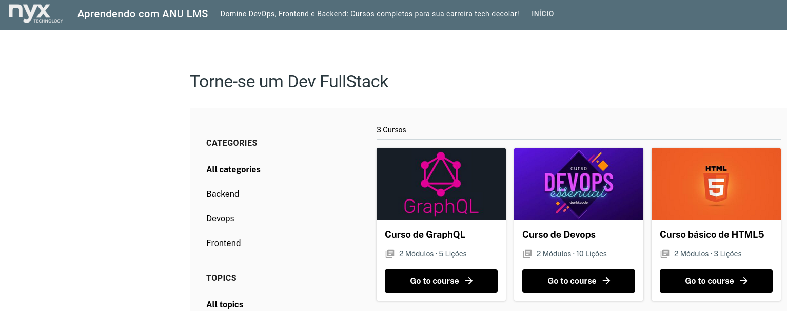

# Projeto Drupal com Anu LMS

Este projeto utiliza o módulo Anu LMS para criar um sistema de gerenciamento de aprendizado (LMS) em uma instalação Drupal.

## Visão Geral

Anu LMS é um módulo contribuído para Drupal que fornece funcionalidades robustas para a criação e gerenciamento de cursos online. Ele permite a criação de cursos, lições, questionários e muito mais, proporcionando uma plataforma completa de aprendizado online.
  

## Requisitos

- Drupal 9.x ou superior
- Módulo Anu LMS
    - Módulos: [ECK](https://www.drupal.org/project/eck), [Field Group](https://www.drupal.org/project/field_group), [Inline Entity Form](https://www.drupal.org/project/inline_entity_form), [Paragraphs](https://www.drupal.org/project/paragraphs), [Paragraphs Selection](https://www.drupal.org/project/paragraphs_selection), [Paragraphs Browser](https://www.drupal.org/project/paragraphs_browser), [REST Entity Recursive](https://www.drupal.org/project/rest_entity_recursive), [Weight](https://www.drupal.org/project/weight).

- Observação:
    ```
    Para o módulo Inline Entity Form: composer require 'drupal/inline_entity_form:^1.0@RC'
    ```

## Instalação

1. **Baixe e instale o Drupal**: Se ainda não tiver o Drupal instalado, siga as instruções na [documentação oficial do Drupal](https://www.drupal.org/docs/installing-drupal).
2. **Instale o módulo Anu LMS**:
    - Via composer: `composer require 'drupal/anu_lms:^2.10'`
    - Ative o módulo através da interface de administração do Drupal ou usando Drush:
      ```bash
      drush en anu_lms
      ```
3. **Configuração Inicial**:
    - Navegue até a página de configuração do Anu LMS em `/admin/config/anu_lms`.
    - Configure os parâmetros necessários de acordo com suas necessidades.

## Funcionalidades

- **Criação de Cursos**: Permite criar e gerenciar cursos, definindo detalhes como título, descrição, e instrutores [PDF](./.docs/como-criar-um-curso.pdf)
- **Lições e Módulos**: Estruture o conteúdo em lições e módulos para uma melhor organização.
- **Questionários**: Crie questionários para avaliar o progresso dos alunos.
- **Certificados**: Gere certificados de conclusão para os alunos.

## Customizando

- Documentação ANU LMS [PDF](./.docs/como-criar-um-curso.pdf)

## Submódulos

### Anu LMS Quizzes
Crie questionários interativos no final do módulo para ajudar os usuários a verificar seus conhecimentos.

Dependências: [Range](https://www.drupal.org/project/range), [Views Data Export](https://www.drupal.org/project/views_data_export), [Excel Serialization](https://www.drupal.org/project/excel_serialization)

```bash
composer require 'drupal/range:^1.5'
composer require 'drupal/views_data_export:^1.4'
composer require 'drupal/xls_serialization:^1.3'

drush en range -y && drush en views_data_export -y && drush en xls_serialization -y && drush en anu_lms_assessments -y
```
- Como criar um Quizz [PDF](./.docs/como-criar-um-questionario.pdf)

### Anu LMS Permissions

Adiciona separação de permissões para organizações, professores e alunos.

Dependências: [Group](https://www.drupal.org/project/group), [Group Media](https://www.drupal.org/project/group_media), [Anu LMS Quizzes](https://www.drupal.org/project/anu_lms_quizzes)

```bash
composer require 'drupal/groupmedia:^3.0'  
composer require 'drupal/group:^2.2'
drush en group -y && drush en gnode -y && drush en groupmedia -y && drush en anu_lms_permissions -y
```
## Suporte

Para mais informações e suporte, clique em [Contato](https://web.whatsapp.com/send?phone=5591982650277&text=Olá!) ou a [seção de issues no Drupal.org](https://www.drupal.org/project/issues/anu_lms).
